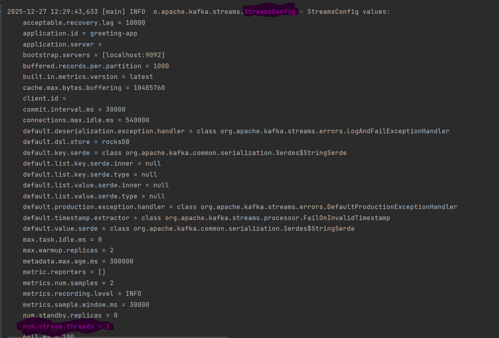
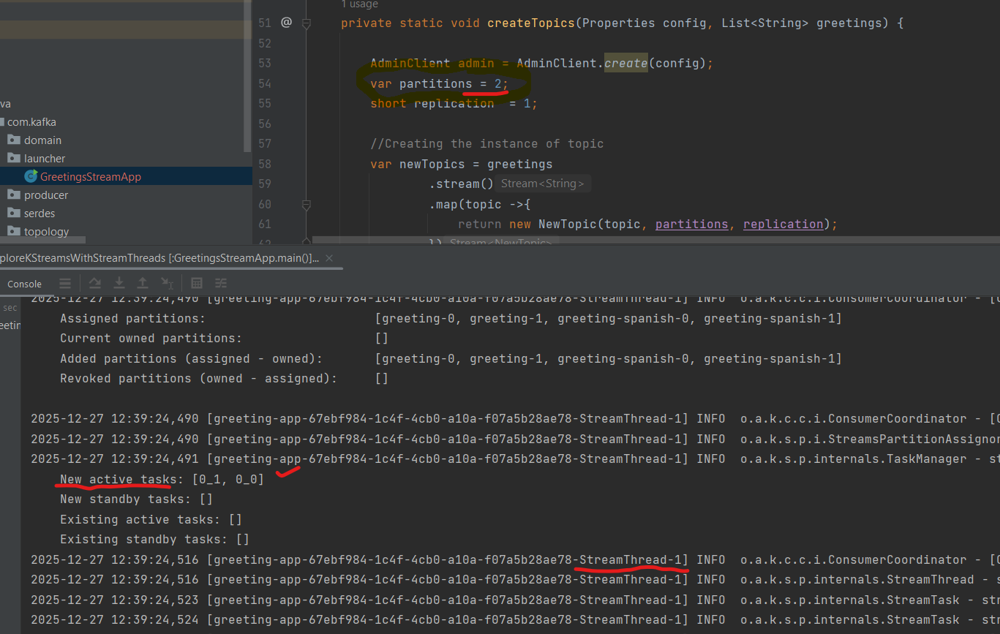
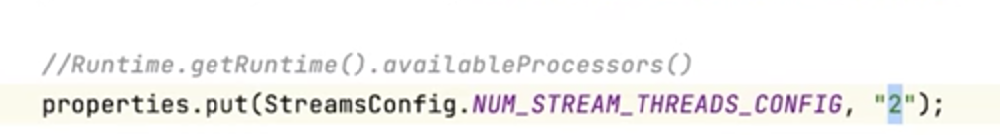
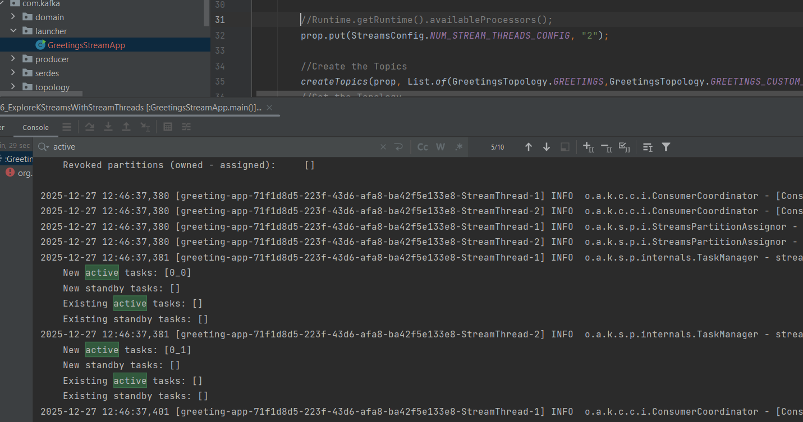

# How Stream Threads works - by modifying the property of stream.threads, how it impact on Kafka Streams application

By default, num.streams.thread = 1 as a part of StreamConfig values.

  

New active tasks = 2 tasks. Reason - Topic that is created has two partitions. As the number of tasks created is based on the total number of partitions.

But one thing that we still have one stream thread, that's one of the reasons why you might be seeing the value as stream thread one. 

This means we have one single thread and we have two tasks.

  

We can add new property by check the number of cores.

  

We can see now two Stream Threads. StreamThread-1 handling task 0_0, StreamThread-2 handling task 0_1.

  

Now we have parallelism in our Kafka Stream application
And these two stream threads are going to consume data from these partitions in parallel. And then it's going to take care of automatically process these data in.
