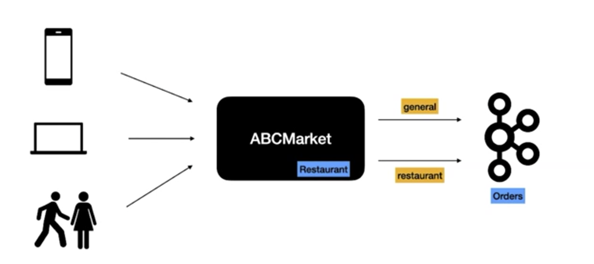
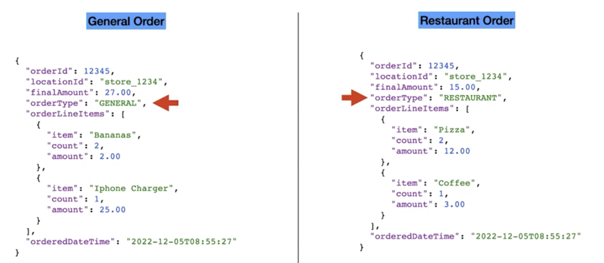
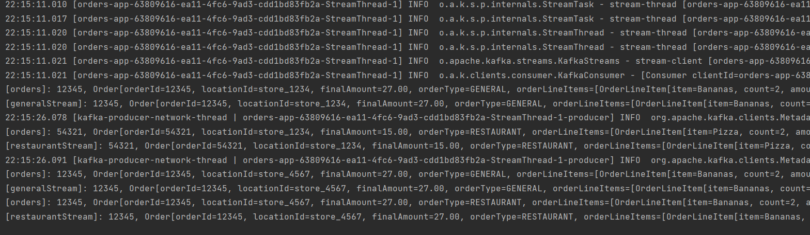
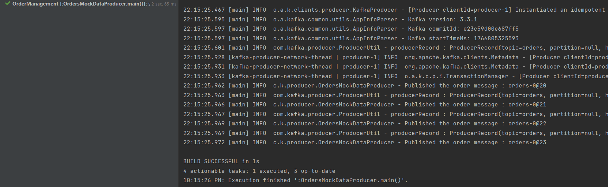
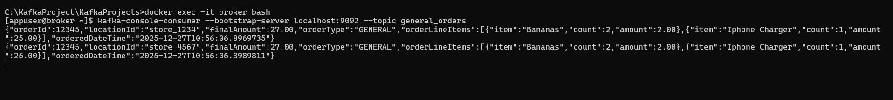
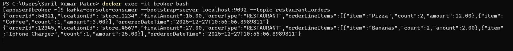
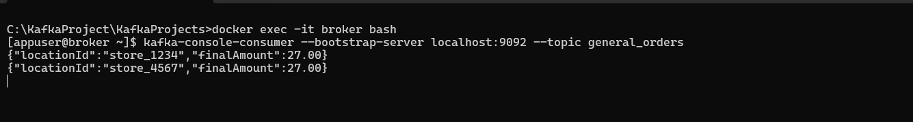
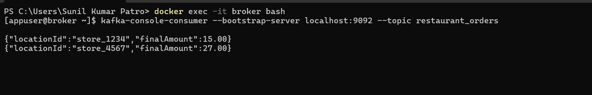

# Set up Order App

This app is going to deal with Order Management domain.

We are going to build Kafka Streams applications for our Retail company "ABCMart". In "ABCMart", customers can order products online, or they can walk in store and buy products. The retail company "ABCMart" also has a restaurant where the customers can order food and dine in the restaurant.

<p align="center">
  
</p>

There are two different types of orders.
1. General orders - This includes groceries, electronics, napkins, etc...
2. Restaurant orders

Both of these orders are published into the Orders Kafka Topic.

Data Model of Retail App - "ABCMart"

<p align="center">
  
</p>

We are publishing general and restaurant orders in two different topics.


## Set up Kafka Environment using Docker

- This should set up the Zookeeper and Kafka Broker in your local environment

```aidl
docker-compose up
```

### Verify the Local Kafka Environment

- Run this below command

```
docker ps
```

- You should be below containers up and running in local

<p align="center">
  
</p>


### Interacting with Kafka

#### Produce Messages

- Run the Kafka Stream OrdersKafkaStreamApp class to produce the Messages

<p align="center">
  
</p>

- Run the OrdersMockDataProducer class to produce the Messages

<p align="center">
  
</p>


#### Consume Messages

- This  command should take care of logging in to the Kafka container.

```
docker exec -it broker bash
```
- Command to consume messages from the Kafka topic.

```
kafka-console-consumer --bootstrap-server localhost:9092 --topic general_orders
```
<p align="center">
  
</p>

```
kafka-console-consumer --bootstrap-server localhost:9092 --topic restaurant_orders
```
<p align="center">
  
</p>

### Publish the transaction amount of these two types of orders
- Transform the Order Type to Revenue Type

### Interacting with Kafka

#### Produce Messages

- Run the Kafka Stream OrdersKafkaStreamApp class to produce the Messages

<p align="center">
  
</p>

- Run the OrdersMockDataProducer class to produce the Messages

<p align="center">
  
</p>


#### Consume Messages

- This  command should take care of logging in to the Kafka container.

```
docker exec -it broker bash
```
- Command to consume messages from the Kafka topic.

```
kafka-console-consumer --bootstrap-server localhost:9092 --topic general_orders
```
<p align="center">
  
</p>

```
kafka-console-consumer --bootstrap-server localhost:9092 --topic restaurant_orders
```
<p align="center">
  
</p>