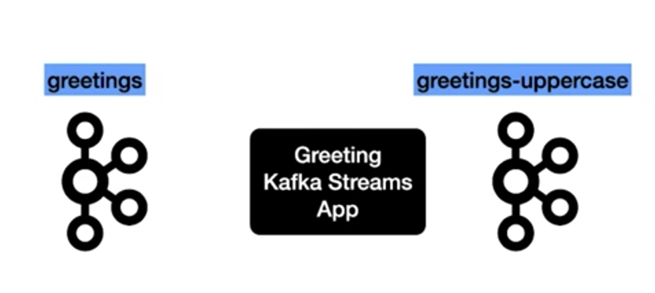
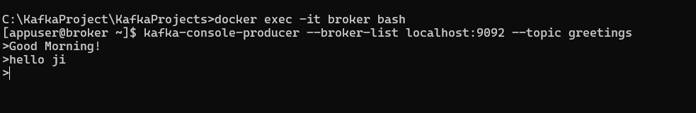
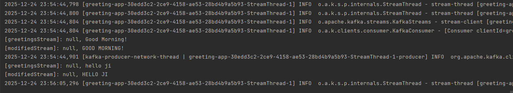

# Set up Greeting App

This app is going to read from a Kafka topic named Greetings and then perform a stream processing logic and write it to another Kafka topic named Greetings uppercase. 

Just perform the uppercase operation and then write it to the Kafka topic.

<p align="center">
  
</p>

We have the Greeting as good morning and our Kafka streams app will read the message and perform the uppercase operation and write it to another Kafka topic named readings uppercase. 

This is a very simple and naive app.


## Set up Kafka Environment using Docker

- This should set up the Zookeeper and Kafka Broker in your local environment

```aidl
docker-compose up
```

### Verify the Local Kafka Environment

- Run this below command

```
docker ps
```

- You should be below containers up and running in local

<p align="center">
  
</p>


### Interacting with Kafka

#### Produce Messages

- This  command should take care of logging in to the Kafka container.

```
docker exec -it broker bash
```

- Command to produce messages in to the Kafka topic.

```
kafka-console-producer --broker-list localhost:9092 --topic greetings
```

#### Consume Messages

- This  command should take care of logging in to the Kafka container.

```
docker exec -it broker bash
```
- Command to consume messages from the Kafka topic.

```
kafka-console-consumer --bootstrap-server localhost:9092 --topic greetings_uppercase
```

<p align="center">
  
</p>

<p align="center">
  
</p>

<p align="center">
  
</p>