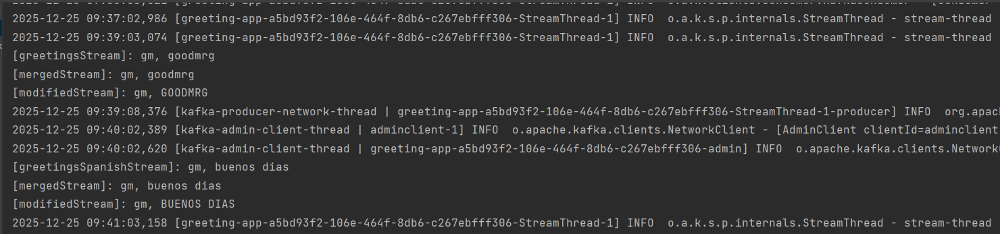
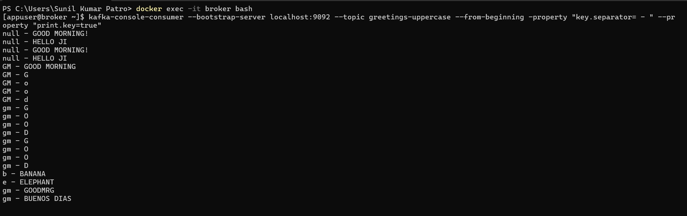

# Set up Greeting App + Operators

This app perform the merge operation and then convert the merged value to uppercase and write it to the Kafka topic.
This operation combines two independent Kafka Streams into a single Kafka Stream.

<p align="center">
  
</p>

Let's say we have two cases streams which are being read from two different topics. And we have a business use case to channel that data that's coming out from these two topics into one single topic. 
In those kind of scenarios, we can use the merge operator to channel data that's coming from two different topics into one single topic.

We will have 3 topics here - GREETINGS, GREETINGS_SPANISH, GREETINGS_UPPERCASE

We are merging GREETINGS and GREETINGS_SPANISH into GREETINGS_UPPERCASE topic


## Set up Kafka Environment using Docker

- This should set up the Zookeeper and Kafka Broker in your local environment

```aidl
docker-compose up
```

### Verify the Local Kafka Environment

- Run this below command

```
docker ps
```

- You should be below containers up and running in local

<p align="center">
  
</p>


### Interacting with Kafka

#### Produce Messages

- This  command should take care of logging in to the Kafka container.

```
docker exec -it broker bash
```

- Command to produce messages in to the Kafka topic.

```
kafka-console-producer --broker-list localhost:9092 --topic greetings
```

- Publish to **greetings** topic with key and value

```
kafka-console-producer --broker-list localhost:9092 --topic greetings --property "key.separator=-" --property "parse.key=true"

```

- Publish to **greetings-spanish** topic with key and value

```
 kafka-console-producer --broker-list localhost:9092 --topic greetings_spanish --property "key.separator=-" --property "parse.key=true"
```


#### Consume Messages

- This  command should take care of logging in to the Kafka container.

```
docker exec -it broker bash
```
- Command to consume messages from the Kafka topic.

```
kafka-console-consumer --bootstrap-server localhost:9092 --topic greetings_uppercase
```

- Command to consume with Key

```
kafka-console-consumer --bootstrap-server localhost:9092 --topic greetings_uppercase --from-beginning -property "key.separator= - " --property "print.key=true"
```

#### Producer side - Publish the message in topic - GREETINGS - "gm-goodmrg"

<p align="center">
  
</p>

#### Producer side - Publish the message in topic - GREETINGS-SPANISH - "gm-buenos dias"

<p align="center">
  
</p>

#### KStreams App - where the map operation with merge is done

<p align="center">
  
</p>

#### Consumer side - consumes the message with key from both topics - "GM - GOODMRG" and "GM - BUENOS DIAS"

<p align="center">
  
</p>
